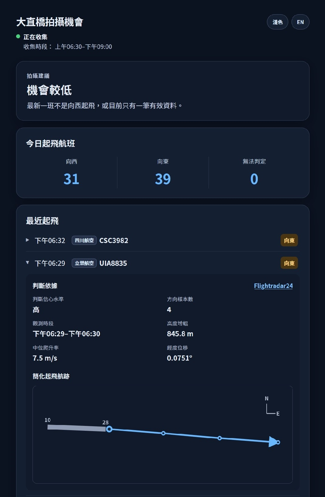
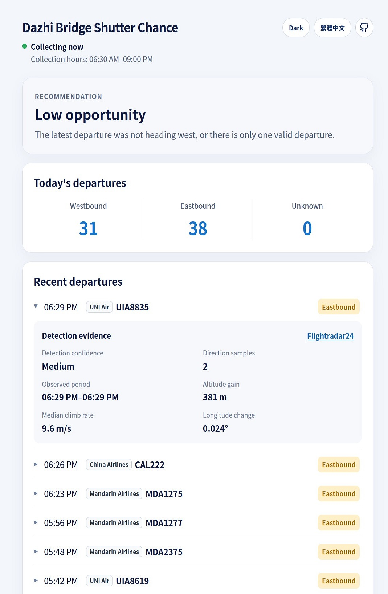

# 大直橋飛機拍攝機會判斷系統

## 目錄

- [快速開始](#快速開始)
- [資料來源與公開限制](#資料來源與公開限制)
- [其它文件](#其它文件)

本服務觀察臺北松山機場附近的航班航跡，辨識起飛事件與方向，並依近期航班及資料新鮮度提供前往大直橋拍攝的建議。

本服務僅根據公開 ADS-B 資料提供最佳努力估計，不應用於航管或飛航安全用途，也不保證能偵測到每一架起飛航機。

## 快速開始

需要 Node.js 22 或更新版本。

```sh
npm ci
npm test
npm run migrate
npm start
```

啟動服務後開啟 `http://127.0.0.1:3000/`。介面支援繁體中文、英文、dark mode、今日統計、近期 departure、歷史 7／30 日／全部統計，以及簡化方向／航跡資訊。

本專案提供兩種架設方式：
* 自架 dashboard 直接讀取服務資料
* 公開靜態版本則讀取定期產生的 summary snapshot

部署方式的差異、完整的環境變數、Docker Compose、HTTP API、備份還原及維護方式請見 [安裝與維運教學](docs/INSTALLATION.md)。

| 自架版本 | 公開靜態版本 |
|---|---|
|  |  |

## 資料來源與公開限制

adsb.fi 是預設 provider，也建議僅使用該 provider。

OpenSky adapter 只保留作已適當授權的替代來源，因其現行[Data License Agreement](https://opensky-network.org/about/terms-of-use)規定，REST API 用於 live product、service 或 automated system 的 operational use，即使是非營利 主體也必須事先取得書面授權。

adsb.fi Open Data 條款允許個人、非商業 API 使用，禁止授權或販售資料／服務，並要求連結 [adsb.fi](https://adsb.fi/) 署名。

條款沒有明確授予位置點的重新發布權，因此公開服務建議使用不含精確位置與航跡的 `summary`模式。詳見[官方條款](https://github.com/adsbfi/opendata/blob/main/README.md#terms)
與 [ADR-0004](docs/adr/0004-separate-public-summary-and-private-precise-data.md)。

基於以上考量，正規化 observations、departures 與每次 provider request attempt 的 `collector_request_history` 只永久保存在本地 SQLite。成功的 adsb.fi 完整 response 另以 gzip JSON Lines 保存在私人主機，不會放入公開 snapshot。

## 其它文件

- [自架安裝與維運教學](docs/INSTALLATION.md)：設定、Docker Compose、API、備份與日常維護。
- [GitHub Pages 靜態快照](docs/GITHUB_PAGES.md)：公開 snapshot 的設定、同步與發布。
- [Architecture Decision Records](docs/adr/README.md)：現行重大架構決策。
- [Validation](docs/validation/README.md)：資料來源量測、人工比對、soak test 與可重現的驗證證據。
- [Archive](docs/archive/)：過去的規畫、選項與逐步實作日誌。僅供追溯，不是現行規格。
- [階段狀態](docs/PLANS.md)：已完成階段與持續事項。
